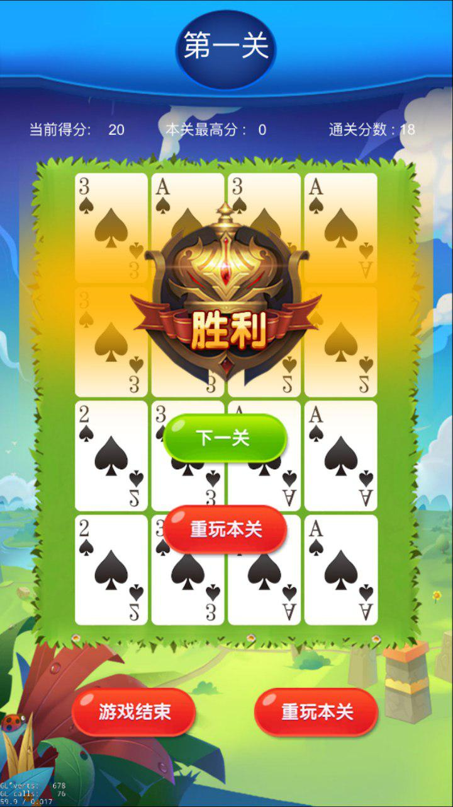

# 纸牌数字-印象记忆



```
纸牌数字-印象记忆的灵感来自于扫雷型游戏，挑战着玩家的记忆力、分析能力、分析速度。
进入首页，选择挑战的关卡。进入游戏界面后，我们会看到16张覆盖着的纸牌，点击纸牌，纸牌会翻面，如果连续点击的两张纸牌一样， 则两张纸牌会翻面，如果连续点击的两张纸牌不一样，则两张纸牌不反面。直到所有的纸牌翻面，游戏结束。
第一关可能就有一点点难度哦，不过相信聪明果断的你肯定可以过关。但是后面的关卡呢？可能就不好说了。
我们在最后一关，等你来战！
```

contact us: **+8618873621662**
